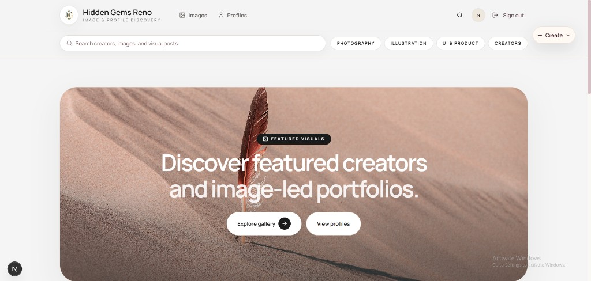
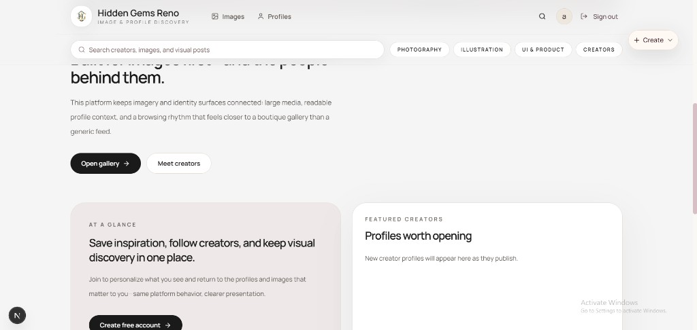
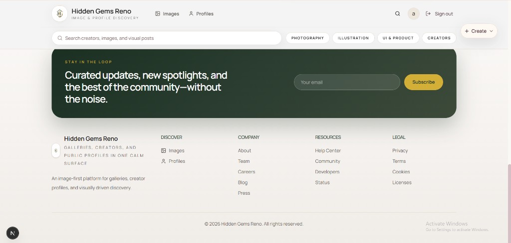
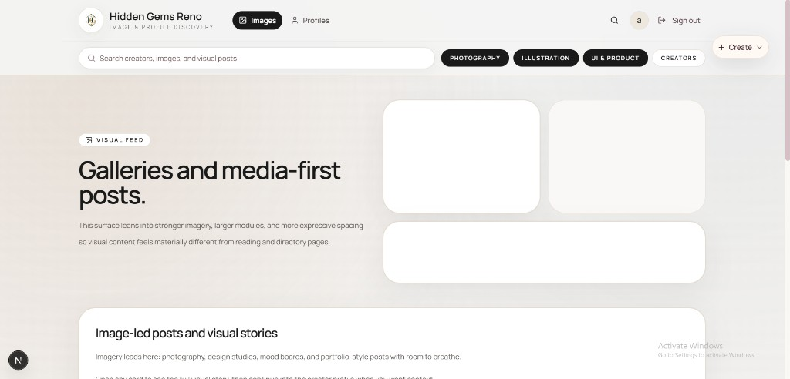
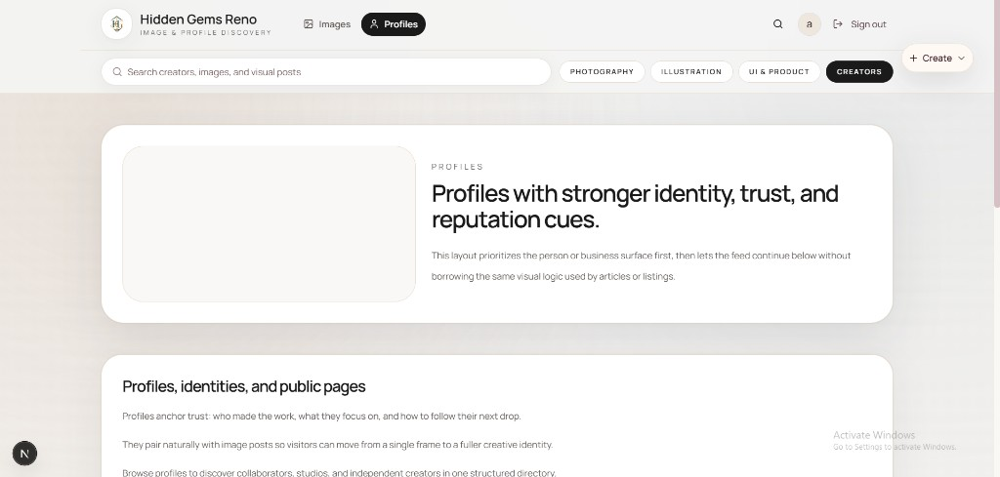
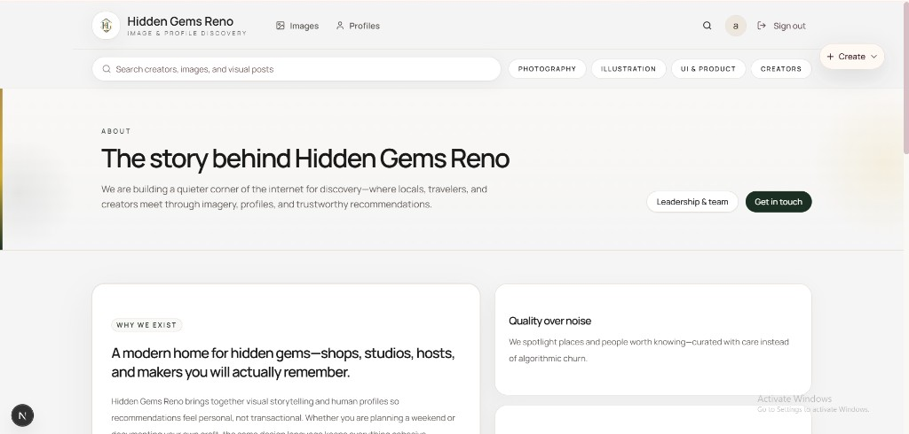

# Hidden Gems Reno

Next.js app for **image and profile discovery**—soft-minimal UI, warm neutrals, and gallery-style layouts.

## UI screenshots

Images are stored in-repo under [`docs/readme-screenshots/`](docs/readme-screenshots/) so they render on GitHub without external hosting.

### Home — hero



### Home — discovery & CTAs



### Home — newsletter & footer



### Images feed



### Profiles



### About



## Development

```bash
pnpm install
pnpm dev
```

```bash
pnpm build
pnpm start
```
